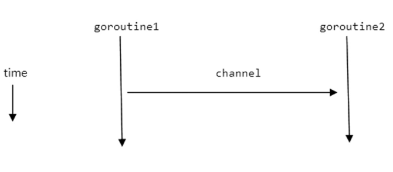
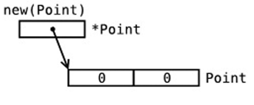
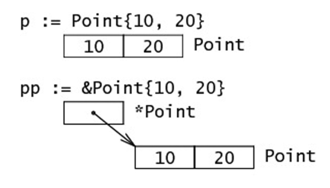
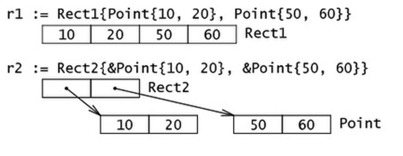

# Seminario 4 (Go)


#### 1 - ¿Cuál es la forma de procesamiento del código fuente utilizada?

Go es un lenguaje de programación concurrente, compilado, imperativo, estructurado, inspirado en la sintaxis del lenguaje C, que intenta ser dinámico como Python y con el rendimiento de  C o C++. El compilador de *Go* se divide lógicamente en cuatro etapas 

 1. **Análisis léxico y gramatical**

    Análisis del archivo fuente del código. Se convierte la secuencia de cadenas en el archivo en una secuencia `Tokens` para el posterior análisis.(este análisis léxico lo realiza el lexer)

    Al análisis gramatical entra la secuencia de tokens que genera le analizador léxico. Estas secuencias serán analizadas por el analizador gramatical en orden. El procesos de análisis gramatical es seguir la gramática definida por el análisis léxico de abajo hacia arriba. O la especificación de arriba hacia abajo, cada archivo de código fuente de *Go* se resumirá en una estructura `SourceFile`:

     ```
     SourceFile = PackageClause ";" { ImportDecl ";" } { TopLevelDecl ";" }
     ```

    El analizador sintáctico estándar de Goland  utiliza la gramática de LALR. El resultado del análisis sintáctico es en realidad el árbol de sintaxis abstracta (AST). Cada AST corresponde a un archivo de *Go* independiente. Este árbol de sintaxis abstracta incluye el nombre del paquete, las constantes definidas, las estructuras y las funciones del archivo actual. 

    Si se produce algún error de sintaxis durante el proceso de análisis, el analizador lo encontrará y el mensaje se imprimirá en la salida estándar. Todo el proceso de compilación también se abortará cuando se produzca un error.

    

 2. **Verificación de Tipos y conversión AST** 

    Después de obtener el árbol de sintaxis abstracta (AST) de un conjunto de archivos, el compilador del lenguaje verificará los tipos definidos y usados en el árbol de sintaxis. La verificación de tipos verificará diferentes tipos de nodos en orden: 

     - Constantes, tipos y tipos de funciones 
     - Asignación e inicialización de variables 
     - El cuerpo de la función y cierre 
     - Tipos de pares clave- valor hash
     - Importe de cuerpo de la función 
     - Declaración externa.   

    Al recorrer cada árbol de nodos abstractos se verifica el tipo de subarbol actual en cada nodo para asegurar que no habrá errores de en el nodo actual. Todos los errores de tipo y desajuste estarán en esta etapa. 

    La etapa de verificación de tipos no solo verifica los nodos de la estructura del árbol, sino que también expande y reescribe algunas funciones integradas. Por ejemplo la palabra clave make sera reemplazada con funciones como makeslice o makechan en esta etapa de acuerdo con la estructura del subárbol. 

    La verificación de tipos no solo verifica el tipo, sino que también reescribe el AST y procesa las palabras claves integradas del lenguaje *Go*. Por lo tanto este proceso es muy importante en todo el proceso de compilación. Sin este paso , muchas claves no estarán disponibles. 

 3. **Generación SSA general** 

    Cuando se convierte el archivo fuente en un árbol de sintaxis abstracta, se analiza la gramática de todo el árbol de sintaxis y se realiza la verificación de tipos, entonces el código no tiene problemas de incompilación o errores gramaticales. El compilador convertirá el AST de entrada en código intermedio. 

    El código intermedio del compilador de *Go* utiliza la función SSA (Formulario de asignación única estática). Usando esta función en el proceso de generación de código intermedio, se puede analizar fácilmente las variables y fragmentos inútiles en el código. 

    Después de la verificación de tipos, una función llamada compileFunctions comenzará a compilar todas las funciones en todo el proyecto del lenguaje *Go*. Estas funciones esperarán el consumo de varias corrutinas de trabajo del back-end en una cola de compilación.

 4. **Generación final del código de maquina** 

    El directorio `cmd/compiler/internal` del código fuente del lenguaje *Go* contiene una gran cantidad de paquetes relacionados con la generación de código máquina. Los diferentes tipos de CPU usan diferentes paquetes para generar  `amd64` `arm` `mips` `mips64` `ppc64` `s390x` `x86` y `wasm`, lo que significa que el lenguaje *Go* en casi todos los tipos de conjuntos de instrucciones de CPU comunes.

    
    
  ##### Entrada del compilador 

La entrada del compilador del lenguaje de *Go* es el archivo main.go en el paquete `src/cmd/compile/internal/gc` . Esta función es el programa principal del compilador del lenguaje *Go*. Esta función primero obtiene la entrada de la linea de comandos (Parámetro) y actualiza las opciones de compilación y configuración y luego comienza a ejecutar la función `parseFile`  para realizar análisis léxico y gramatical en todos los archivos de entrada para obtener el árbol de sintaxis abstracto correspondiente al archivo. 

A continuación, el árbol de sintaxis abstracta se actualizará y compilara en nueve etapas. Como presentamos anteriormente, todo el proceso pasara por tres partes: verificación de tipos , generación de código intermedio SSA y generación de código maquina.


#### 2 - *Go* es un lenguaje moderno con muchísimas decisiones de diseño intencionales. ¿Que ventajas  y desventajas le da al lenguaje su forma de procesamiento? Tome en cuenta las plataformas sobre las que se usa para elaborar su respuesta.

*Go* es un lenguaje que se pensó haciendo énfasis en la simplicidad lo que lo hace fácil de aprender. Su sintaxis es pequeña por lo que no tendrás que pasar años hojeando la documentación de referencia. El manejo de la memoria y la sintaxis es bastante liviana lo que lo hace fácil de usar. Tiene una compilación rápida lo que mejora la productividad. Tiene un rápido código compilado acercándose bastante a C en ese aspecto. Tiene soporte nativo para la concurrencia lo cual permite escribir
código más simple. Es un lenguaje de tipado estático con una librería standar bastante consistente y fácil de instalar para el desarrollo haciendo uso de **go install**. Es autodocumentado. Es libre y de código abierto (licencia BSD).


#### 3 - Realice un sumario sobre las características mas interesantes de la sintaxis de *Go*: (los 3)

- **Presente un Hello World (creatividad apreciada)** 

  ```go
  package main
  
  import "fmt"
  
  func main() {
  	fmt.Println("Hello, World!!!")
  }
  ```

- **Indentación** 

  Un ejemplo de indentacion en Go. 

  ```go
  package main
  
  import (
  	"fmt"
  	"strconv"
  	"strings"
  	"unicode"
  )
  
  func main() {
  
  	text := "Oh! Welcome to Go language."
  
  	text = Indent(text, 6)
  	fmt.Println(text)
  
  	text = Unindent(text, 3)
  	fmt.Println(text)
  
  	text = Unindent(text, 10)
  	fmt.Println(text)
  
  	text = IndentByRune(text, 10, '.')
  	fmt.Println(text)
  }
  
  // Sangrado de la entrada por indentación dada y runa .
  func IndentByRune(input string, indent int, r rune) string {
  	return strings.Repeat(string(r), indent) + input
  }
  
  // Sangrado de la entrada por indentación dada
  func Indent(input string, indent int) string {
  	padding := indent + len(input)
  	return fmt.Sprintf("% "+strconv.Itoa(padding)+"s", input)
  }
  
  // Unindent desangra la cadena de entrada. En caso de que
  // la entrada está sangrada por menos de espacios de "sangría"
  // se elimina el mínimo de ambos.
  func Unindent(input string, indent int) string {
  	count := 0
  	for _, val := range input {
  		if unicode.IsSpace(val) {
  			count++
  		}
  		if count == indent || !unicode.IsSpace(val) {
  			break
  		}
  	}
  
  	return input[count:]
  }
  
  ```

  **Output**: 

  ```
        Oh! Welcome to Go language.
     Oh! Welcome to Go language.
  Oh! Welcome to Go language.
  ..........Oh! Welcome to Go language.
  ```

  

- **Otros elementos de interés en el lenguaje Go**

  Los creadores de Go no querian discusiones sobre el estilo de codigo para el lenguaje Go. Por lo que desarrollaron una herramienta: `go fmt`. Es una impresora que impone el formato y el estilo de codigo estandar del codigo fuente. Es una Herramienta  de reescritura a nivel de sintaxis, una forma simple de refractorizacion. Debe ser utilizado por todo los desarrolladore de Go.  

  La libertad de sintaxis de la que el programador se ve privado tiene ciertamente grandes ventajas al hacer que el código de Go sea uniforme y mejor legible y por lo tanto facilita la lectura y comprensión de código para programadores foráneas. La mayoría de los editores lo tienen integrado. Para la sangría de diferentes niveles en el codigo, la regla no es estricta, se pueden usar tabulaciones o espacios, una tabulación puede ser de 4 u 8 espacios. 

  En la linea de comandos `gofmt -w program.go`  re-formatea el fichero `program.go`  sin el `-w` se muestran los cambios pero no se guardan. 

  Esto puede ser útil para simples cambios(refractorizacion) en el código base.

  **Ejemplos**:

  ```
  gofmt -r “(a) -> a” –w *.go
  ```

   Esto va a remplazar todos los  `(())` innecesarios con `()` en todos los fichero de go en el directorio actual. 

  ```
  gofmt –r ‘A.Func1(a,b) -> A.Func2(b,a)’ –w *.go
  ```

   Esto reemplaza `Func1` con `Func2` e intercambia los argumentos de la función


##### For

*Go* tiene solo una sola estructura para ciclos **for loop**

Un ciclo **for** básico en go tiene tres componentes principales separadas por semicolons(;):

1.  **init statment**:  la declaración init se ejectuta antes de la primera iteración del ciclo
2.  **condition expression**: la condicional es evaluada antes de cada iteración
3.  **post statement**: se ejectuta al final de cada iteración


La declaración init a menudo será una declaración de variable corta(usando **:=**), y las variables declaradas alli son visibles solo en el scope

de esta instrucción. El ciclo for para de iterar una vez que la condición booleana evaluada es falsa. A diferencia de otros lenguajes como *C*, *Java* o *Javascript* aquí no hay paréntesis que rodeen las tress componentes de la instrucción for y las llaves (**{}**) siempre son necesarias.

Ejemplo de instrucción `for` básico en *Go*:


```go
package main

import "fmt"

func main() {
	sum := 0
	for i := 0; i < 5; i++ {
		sum += 2*i
	}
	fmt.Println(sum)
}

```

Las instrucciones init y post son opcionales:

```go
package main

import "fmt"

func main() {
	sum := 0
	for ; sum < 50; {
		sum += 5
	}
	fmt.Println(sum)
}
```

For es también el "while" de *Go* :):

Puedes quitar el semicolon(;) y el "while" está escritor for en *Go*

Ejemplo:

```go
package main

import "fmt"

func main() {
	sum := 1
	for sum < 1000 {
		sum += sum
	}
	fmt.Println(sum)
}

```

Ciclo infinito:

Si tu omites la condición booleana sería un ciclo infinito. Por lo tanto puedes expresar un ciclo infinito de forma compacta (no es necesario poner true como en otros lenguajes)

Ejemplo:

```go
package main

func main() {
	for {
	}
}
```
##### For statements with range clause:  

Una instrucción for con una cláusula range recorre todos los elementos de un array, slice, string, map o valores recibidos en un canal. Por cada entrada este asigna valoros de iteración a las variables de iteración correspondientes y luego ejecuta el bloque.


RangeClause = [ ExpressionList "=" | IdentifierList ":=" ] "range" Expression .

La expresión de la derecha en la clausula **range** se denomina range expression y puede ser un array, puntero a un array,slice,string, map, o un channel que permite operaciones de recepción

For stament with range en array o slices:
```go
package main

import "fmt"

func main() {
    for_range()
}

func for_range() {
	//for statement with range clause in arry or slice
	a := []string{"C++", "C", "Python", "Go"}
	for i, j := range a {
		fmt.Println("index: ", i, " ", "element: ", j)
	}
}
```
##### `If` statement 

Las sentencias if de *Go* al igual que for no necesita estar entre paréntesis () pero los llaves  {} si son obligatorias


```go
package main

import (
	"fmt"
	"math"
)

func sqrt(x float64) string {
	if x < 0 {
		return sqrt(-x) + "i"
	}
	return fmt.Sprint(math.Sqrt(x))
}

func main() {
	fmt.Println(sqrt(2), sqrt(-4))
}

```

##### `if` con **short statement**

Similar a for, la instrucción if puede comenzar con una instrucción corta para ejecutar antes de la condición. Las variables declaradas por la instrucción

solo son accesible en el scope hasta el final del if 

Por ejemplo:

```go
package main

import (
	"fmt"
	"math"
)

func pow(x, n, lim float64) float64 {
	if v := math.Pow(x, n); v < lim {
		return v
	}
	return lim
}

func main() {
	fmt.Println(
		pow(3, 2, 10),
		pow(3, 3, 20),
	)
}

```

##### `if` and `else`

Las variables declaradas dentro de un if short statement son también accesibles dentro de cualquiera de los bloques else

```go
package main

import (
	"fmt"
	"math"
)

func pow(x, n, lim float64) float64 {
	if v := math.Pow(x, n); v < lim {
		return v
	} else {
		fmt.Printf("%g >= %g\n", v, lim)
	}
	// can't use v here, though
	return lim
}

func main() {
	fmt.Println(
		pow(3, 2, 10),
		pow(3, 3, 20),
	)
}

```

Ambas llamadas a **pow**  devuelven sus resultados antes que se haga la llamada a **fmt.Println** en el **main**


##### Switch

Una sentencia **switch** es una manera más corta de escribir una secuencia de  sentencias **if-else**.  Esta ejecuta el primer caso cuyo valor es igual a la expresión de condición .

El switch en *Go* es similar al de *C*, *C++*, *Java*, *Javascript*, y *PHP* excepto que *Go* solo ejecuta el caso seleccionado, no todos los casos que le siguen. En efecto, la declaración break que se necesita al final de cada caso en otros lenguajes es proveída automáticamente en *Go*. Otra diferencia importante es que los switch en *Go* no necesitan ser constantes, y los valores involucrados no necesitan ser enteros.

```go
package main

import (
	"fmt"
	"runtime"
)

func main() {
	fmt.Print("Go runs on ")
	switch os := runtime.GOOS; os {
	case "darwin":
		fmt.Println("macOS")
	case "linux":
		fmt.Println("Linux")
	default:
		// freebsd, openbsd,
		// plan9, windows...
		fmt.Printf("%s.\n", os)
	}
}

```

##### Orden de Evaluación Switch:

Los switch cases en *Go* evalúan los casos top to bottom(de arriba hacia abajo) y para cuando encuentra un caso exitoso.

```go
package main

import (
	"fmt"
	"time"
)

func main() {
	fmt.Println("When's Saturday?")
	today := time.Now().Weekday()
	switch time.Saturday {
	case today + 0:
		fmt.Println("Today.")
	case today + 1:
		fmt.Println("Tomorrow.")
	case today + 2:
		fmt.Println("In two days.")
	default:
		fmt.Println("Too far away.")
	}
}
```

##### Switch sin ninguna condición:

Switch sin ninguna condición es lo mismo que un **switch true**. Esta construcción puede ser una manera limpia de escribir una larga cadena de 
**if-then-else**
```go
package main

import (
	"fmt"
	"time"
)

func main() {
	fmt.Println("When's Saturday?")
	today := time.Now().Weekday()
	switch time.Saturday {
	case today + 0:
		fmt.Println("Today.")
	case today + 1:
		fmt.Println("Tomorrow.")
	case today + 2:
		fmt.Println("In two days.")
	default:
		fmt.Println("Too far away.")
	}
}
```

##### Defer:

Una declaración **defer**  aplaza la ejecución de una función hasta que retorna la función de donde es llamada

Ejemplo:

```go
package main

import "fmt"

func main() {
	defer fmt.Println("world")

	fmt.Println("hello")
}
```
Si ejecutamos nos muestra en pantalla:
```
hello
world
```

##### Stacking defers:

Las llamadas llamdas a funciones diferidas se insertan en un stack. Cuando una función regresa, sus llamdas diferidas son ejecutadas en orden **last-in-first-out (LIFO)**

Ejemplo:
```go
package main

import "fmt"

func main() {
	fmt.Println("counting")

	for i := 0; i < 10; i++ {
		defer fmt.Println(i)
	}

	fmt.Println("done")
}
```
##### Funciones:

Una función en Go puede tomar 0 o más argumentos. Se declara con el keyword **func**. 

Ejemplo:
```go
package main

import "fmt"

func add(x int, y int) int {
	return x + y
}

func main() {
	fmt.Println(add(42, 13))
}
```

Se puede apreciar que el tipo viene después del nombre de la variable

##### Funciones continuadas:

Cuando dos o más nombres de parámetros consecutivos de una función comparten un tipo, en Go puedes omitir el tipo de todos menos del último

Ejemplo: 

```go
package main

import "fmt"

func add(x, y int) int {
	return x + y
}

func main() {
	fmt.Println(add(42, 13))
}
```
En este ejemplo acortamos:
**x int, y int** a **x, y int**

###### Funciones con mútiples resultados

Una función en Go puede retornar cualquier cantidad de resultados:

Ejemplo:

```go

import "fmt"

func swap(x, y string) (string, string) {
	return y, x
}

func main() {
	a, b := swap("hello", "world")
	fmt.Println(a, b)
}
```
La función swap retorna dos strings

##### Named return values:

Se puede nombrar los valores de retorno de una función en Go. Si es así se tratan como variables definidas en la parte superior de la función. Estos nombres deben usarse para documentar el significado de los valores devueltos.
Una declaración return sin argumentos retorna los valores de retorno nombrados. Esto es conocido como **"naked" return**
Las **naked return statements** deben ser usadas solamentes en funciones cortas, pues pueden dañar la legibilidad en funciones largas.

Ejemplo:

```go
package main

import "fmt"

func split(sum int) (x, y int) {
	x = sum * 4 / 9
	y = sum - x
	return
}

func main() {
	fmt.Println(split(17))
}

```

##### Variables:

Una declaración **var** puede incluir inicializadores, uno por cada variable. Si el inicializador está presente, el tipo de la variable puede ser omitido; la variable tomará el tipo del valor con el que se inicializó.

Ejemplo de variables con inicializadores:
```go
package main

import "fmt"

var i, j int = 1, 2

func main() {
	var c, python, java = true, false, "no!"
	fmt.Println(i, j, c, python, java)
}

```

##### Declaración de variable corta usuando **:=**:

Dentro de una función, la declaración de asignación corta := puede ser usada en lugar de en lugar de var con el tipo implícito. Fuera de una función **:=** no puede ser usada.

```go
package main

import "fmt"

func main() {
	var i, j int = 1, 2
	k := 3
	c, python, java := true, false, "no!"

	fmt.Println(i, j, k, c, python, java)
}
```

##### Constantes:

Las constantes son declaradas como las variables , pero con el keyword **const**. Las constantes pueden ser character, string, boolean, o valores numéricos. Las constantes no pueden ser declaradas usando la sintaxis **:=**

Ejemplo:
```go
package main

import "fmt"

const Pi = 3.14

func main() {
	const World = "世界"
	fmt.Println("Hello", World)
	fmt.Println("Happy", Pi, "Day")

	const Truth = true
	fmt.Println("Go rules?", Truth)
}
```

### Goroutines

Las partes de una aplicación que se ejecutan de forma concurrente son conocidas como **goroutine** en Go. Aquí no hay correspondencia 1 a 1 entre las goroutines  y los threads del sistema operativo: una goroutine se mapea(multiplexa, ejecuta) en uno o más hilos(threads) según la disponibiliad
Las **goroutines** son ligeras, muchos más ligeras que un **thread**. Las tareas concurrentes podrían incluir obtener datos de un servidor web, computar millones de dígitos de pi, o controlar un brazo de un robot. Esto se logra mediantes el **goroutine-scheduler** en tiempo de ejecucición(runtime) de Go. Las goroutines en Go usan muy poca memoria y recursos.

Iniciar una goroutine es tan fácil como llamar a unan función. Todo lo que necesitas es el keyword go delante del llamado a la función. Cada vez que usuamos el keyword go se inicia una nueva goroutine. Todas las goroutines parecen ejecutarse al mismo tiempo. Sin embargo, es posible que técnicamente no se ejecuten al mismo tiempo, porque las computadoras solo tienen un número limitado de processing units. Las goroutines se ejecutan en el mismo espacio de memoria por lo que el acceso a la memoria compartida debe ser sincronizado.


Ejemplo de goroutine:
```go
package main

import (
	"fmt"
	"time"
)

func say(s string) {
	for i := 0; i < 2; i++ {
		time.Sleep(100 * time.Millisecond)
		fmt.Println(s)
	}
}

func suma(a int, b int) {
	time.Sleep(100 * time.Millisecond)
	suma := a + b
	fmt.Println(suma)
}
func main() {
	go say("world")
	go suma(1, 2)
	say("hello")
}
```

Si ejecutamos el código se debe imprimir en consola:
```
❯ go run main.go
3
world
hello
world
hello
```

Lo ejecutamos otra vez :
```
❯ go run main.go
hello
3
world
hello
```
Y si lo volvemos a ejecutar podría dar otra salida pues depende mucho de que routine termine primero.


**_Channels: para comunicación entre goroutines_**

En el ejemplo anterior las goroutines se ejecutaban independientemente, sin comunicarse entre ellas. 
Las **goroutines** podrían comunicarse mediante el uso compartido de 
variables, pero esto se desaconseja mucho porque esta forma de trabajar presenta todas las dificultades
con la memoria compartida en multihilo(multi-threading). 
En cambio, Go tiene un tipo especial, channel, que es como un conducto(pipe) a través del cual se pueden enviar valores de un tipo y comunicarlo entre goroutines, evitando
todos los problemas de la memoria compartida; el mismo acto de comunicarse a través de un channel garantiza la sincronización. Los datos son transmitidos en los channels: solo una goroutine tiene acceso a un elemento de datos en cualquier momento: por lo que se conoce como data races no puede ocurrir, por diseño. La propiedad de los datos( la habilidad de read y write) se transmite.

Los channels cumplen con el doble propósito de la comunicación: el intercambio de un valor, con sincronización garantizando que dos goroutines estén en un stado conocido en cualquier momento.



La declaración de un channel de forma general es :
```go
var identifier chan datatype
```

El valor de un channel no inicializado es nil.

Un channel solo puede transmitir elementos de datos de un tipo de datos(ej: chan int o chan string), pero todos los tipos se pueden utilizar en un canal, incluso la empty interface{} y un channal de channnel (útil en muchos casos)
Un channel es también un tipo por referencia, por lo que se usa la función make() para alocar memoria para este. 

Ejemplos de channels:

channel de tipo string:
```go
var ch1 chan string
ch1 = make(chan string)
```
channel de tipo int:
```go
chanOfChans := make(chan chan int)
```

channel de channels de int:
```go
chanOfChans := make(chan chan int)
```
channel de funciones:
```go
funcChan := chan func()
```

_Operador de comunicación **<-**_

Este operador representa de manera muy intuitiva la transmisión de datos: la información fluye en la dirección
de la flecha.

_Haci el channel (sending):_

```go
ch <- int1
```
Significa que la variable int1 se envía a través del channel ch

_Desde el channel (receiving):_

```go
int2 = <- ch
```
Significa que la variable int2 recibe la data(obtiene un nuevo value) desde el canal ch; esto supone que int2 ya está declarado; si no puede ser escrito como: **int2:=<-ch**

```go
<- ch
```
Puede usarse a si mismo para obtener el siguiente valor del canal, este valor se descarta efectivamente , pero se puede testear por lo que el siguiente es un código legal
Por ejemplo :
```go
if <-ch != 1000 {
…
}
```

Ejemplo:
```go
package main

import "fmt"

func sum(s []int, c chan int) {
	sum := 0
	for _, v := range s {
		sum += v
	}
	c <- sum // send sum to c
}

func main() {
	s := []int{7, 2, 8, -9, 4, 0}

	c := make(chan int)
	go sum(s[:len(s)/2], c)
	go sum(s[len(s)/2:], c)
	x, y := <-c, <-c // receive from c

	fmt.Println(x, y, x+y)
}
```

El código de ejemplo suma los números en un slice, distribuyendo el trabajo entre dos goroutines. Una vez que ambas goroutines han completado su ejecución, calcula el resultado final.

_Buffered Channels:_

Los channels se pueden almacenar en buffer. Se le proporciona el lenght del buffer como segundo argumento de make para inicializar un buffered channel.

```go
ch := make(chan int, 100)
```
De esta forma envia un bloque al buffered channel  solo cuando el buffer está lleno y recibe el bloque cuando el buffer está vacío.

Ejemplo
```go
package main

import "fmt"

func main() {
	ch := make(chan int, 2)
	ch <- 1
	ch <- 2
	fmt.Println(<-ch)
	fmt.Println(<-ch)
}

```
Pero si hacemos hacemos 1 más que el lenght del buffer:
```go
package main

import "fmt"

func main() {
	ch := make(chan int, 2)
	ch <- 1
	ch <- 2
	ch <- 3
	fmt.Println(<-ch)
	fmt.Println(<-ch)
}
```

Daría error :


```
fatal error: all goroutines are asleep - deadlock!
```
_Range y Close:_

Un sender puede cerrar un channel para indicar que no se enviará más valores. Los receptores pueden probar si un canal se ha cerrado asignando un segundo parámetro a la expresión de recepción:
```go
v, ok := <-ch
```
ok es _false_ si no hay más valores que recibir y el canal está cerrado

Ejemplo:
```go
package main

import (
	"fmt"
)

func fibonacci(n int, c chan int) {
	x, y := 0, 1
	for i := 0; i < n; i++ {
		c <- x
		x, y = y, x+y
	}
	close(c)
}

func main() {
	c := make(chan int, 10)
	go fibonacci(cap(c), c)
	for i := range c {
		fmt.Println(i)
	}
}
```
close(c) cierra el channel c

El ciclo for i:= range c recibe valores del channel repetidamente hasta que es cerrado.

Solo el sender puede cerrar el channel, nunca el receiver. Enviar a un channel cerrado puede causar panic.

_Select in goroutines_:

La declaración select permite que una goroutine espere en mútlples operaciones de comunicación

Select bloque hasta que uno de sus casos pueda ejecutarse, luego ejecuta ese caso. Si hay varios listos elige uno al azar.

Ejemplo:
```go
package main

import "fmt"

func fibonacci(c, quit chan int) {
	x, y := 0, 1
	for {
		select {
		case c <- x:
			x, y = y, x+y
		case <-quit:
			fmt.Println("quit")
			return
		}
	}
}

func main() {
	c := make(chan int)
	quit := make(chan int)
	go func() {
		for i := 0; i < 10; i++ {
			fmt.Println(<-c)
		}
		quit <- 0
	}()
	fibonacci(c, quit)
}
```


- Creación de variables 

- Ciclos ```for```

- Indentacion 

- Condiciones ```if``` con declaración de varaibles en la condición 

- Funciones con múltiples retornos 

- Otros elementos de las sintaxis que consideres relevante  a mostrar


#### 4 - Presente los tipos nativos

 1. **Enteros** 

    *Go* tiene los siguientes tipos de enteros independientes de la arquitectura

    | Nombre | signo    | bits   | type     | Range                                        |
    | ------ | -------- | ------ | -------- | -------------------------------------------- |
    | uint8  | unsigned | 8-bit  | integers | (0 a 255)                                    |
    | uint16 | unsigned | 16-bit | integers | (0 a 65535)                                  |
    | uint32 | unsigned | 32-bit | integers | (0 a 4294967295)                             |
    | uint64 | unsigned | 64-bit | integers | (0 a 18446744073709551615)                   |
    | int8   | signed   | 8-bits | integers | (-128 a 127)                                 |
    | int16  | signed   | 16-bit | integers | (-32768 a 32767)                             |
    | int32  | signed   | 32-bit | integers | (-2147483648 a 2147483647)                   |
    | int64  | signed   | 64-bit | integers | (-9223372036854775808 a 9223372036854775807) |

1. **Flotantes**

   Los números flotantes y complejos también vienen en diferentes tamaños:

   | Nombre  | Signo    | bits   | Type                   |
   | ------- | -------- | ------ | ---------------------- |
   | float32 | IEEE-754 | 32-bit | floating-point numbers |
   | float64 | IEEE-754 | 64-bit | floating-point numbers |

2. **Complejos**

   | Nombre     | Especificaciones                                      |
   | ---------- | ----------------------------------------------------- |
   | complex64  | complex numbers with float32 real and imaginary parts |
   | complex128 | complex numbres with float64 real and imaginary parts |

    También existen varios alias de tipos de números, que asignan nombres útiles a tipos de datos específicos:
   
   | Alias | Tipo de datos |
   | ----- | ------------- |
   | byte  | uint8         |
   | rune  | int32         |

3. **Booleanos**
    El tipo de datos booleanos puede ser uno de los dos valores, ya sea `true` o `false` y se define como `bool` al declararlo como un tipo de datos. Estos valores siempre aparecen con `t` y `f` ya que son identificadores declarado previamente en *Go*.

4. **Cadenas**

    Una cadena es una secuencia de uno o mas caracteres (letras, números, símbolos) que pueden ser una constante o una variable. Las cadenas existen dentro de comillas invertidas en *Go* y tienen diferentes características según se utilice.

    Si se utiliza comilla invertida, creara un literal de cadena sin formato. Si utiliza comillas inversas, a veces se conocen como tildes inversas. Dentro de las comillas, cualquier carácter aparecerá como se muestra entre las comillas inversas,  excepción del propio carácter de comilla inversa.

    ```go
    fmt.Println(`Say "Hello World" to Go`)
    ```

    **Output:** ```Say "Hello World" to Go``` 

    Normalmente las barras diagonales inversas se usan para representar caracteres especiales de cadenas. Sin embargo, las barras diagonales inversas no tiene un significado especial dentro de las  caracteres de cadena sin formato. 

    ```go
    fmt.Println(`Say "Hello World" to Go\n`)
    ```

    **Output:** ```Say "Hello World" to Go\n```

  

#### 5 - Comente sobre ```nil``` y los valores por defecto (Daniel) 

En Go, `nil` es el valor por defecto para los punteros, interfaces, mapas, slices, canales y funciones. Y corresponde a un valor no inicializado. `nil` no es mas que otro posible valor valido. Sin embargo `nil` no es un valor valido para los tipos básicos (enteros, coma flotante, boleanos, etc)ni tampoco para los `structs` 

 

  1. ##### Valores por defecto para los `string` 

      Los valores por defecto para los string en Go es un string vacio `""`

      ```go
      package main
      
      import "fmt"
      
      func main (){
          var message string 
          fmt.Println(message) 
      }
      ```
      
      **Output**: ` `


  2. ##### Valores por defecto para los enteros 

      En *Go* existen varios tipos para los enteros primitivos, estos son: `int` `int8` `int16` `int32` `int64` `uint` `uint8` `uint16` `uint32` `uint64` `uintptr` `byte` `rune` . 
      
       Los valores por defecto para todos esos tipos de enteros en Go son el numero `0` .
      
      ```go
      package main
        
      import "fmt"
      
      func main() {
         var num int
         var num1 int8
         var num2 uint16
         var num3 uintptr
         var num4 byte
         var num5 rune
      
         fmt.Println(num, num1, num2, num3, num4, num5) // 0, 0, 0, 0, 0, 0
      }
      ```
    
      **Output**: `0 0 0 0 0 0`


  3. ##### Valores por defecto para los Floats

      Como en los enteros en *Go* hay multiples tipos para representar los floats. Los tipos para los floats son `float32` `float64`

      El valor por defecto para los floats en *Go* es `0`  , como en los enteros.
          

      ```go
      package main 
      
      import "fmt" 
      
      func main(){
          var num float32
          var num1 float64
          
          fmt.Println(num,num1)
      }
      ```

      **Output**: `0 0`

  4. ##### Valores por defecto para los Complejos

      En *Go* tambien existen dos tipos primitivos para representar los numeros complejos que pueden tener o no parte imaginaria. Los dos tipos son `complex64` `complex128` y susu valores por defecto son `(0+0i)`.
      
      ```go
      package main 
      
      import "fmt" 
      
      func main(){
          var num complex64
          var num1 complex128
          
          fmt.Println(num,num1)
      }
      ```
    
      **Output**: `(0+0i) (0+0i)`

  5. ##### Valores por defecto para los booleanos

      El valor por defecto para el tipo `bool` en *Go* es `false`
      
      ```go
      package main
      
      import "fmt"
      
      func main() {
         var facts bool
      
         fmt.Println(facts) // false
      }
      ```
      
      **Output**: `false`
      
  6. ##### Valores por defecto para los Punteros 

      Los valores por defecto para los punteros en *Go* es `nil`

      ```go
      package main
      
      import "fmt"
      
      func main() {
         var num *int
      
         fmt.Println(num)
      }
      ```

      **Output:** `nil`

  7. ##### Valores por defecto para los Structs

      Los tipos por defecto para las variables de los Strucut son los propos valores por defecto de cada uno de los tipos presentados. 

      ```go
      package main
      
      import "fmt"
      
      type Person struct {
        Name string
        Age int
      }
      
      func main() {
        var ado Person
      
        fmt.Println(ado) // { "", 0 }
      }
      ```

       **Output:**`{"",0}`

  8. ##### Valores por defecto para los Slices

      Los valores por defecto para los slices en *Go* en `nil`. Un slice `nil` tiene una longitud y una capacidad `0`  y no tiene ningún array subyacente. 

      Si se imprime un slice vacio, se va a obtener de vuelta un `[]` en vez de`nil`. Pero sin embargo si se pregunta si un slice vacío es igual a `nil`, se va a retornar `true`. 

      ```go
      package main
      
      import "fmt"
      
      func main() {
      	var s []int
      	fmt.Println(s) // []
      	if s == nil { // true
      		fmt.Println("nil!")
      	}
      }
      ```

      **Output:** ` [] , nil!`

  9. ##### Valores por defecto para los `Maps` en *Go* 

      Los valores por defecto para los maps en *Go* es `nil`. Igual que con los slices. si se imprime un map vacio se optiene `map []`, pero si se chequea si el map es `nil` se obtiene `true`. 

      ```go
      package main
      
      import "fmt"
      
      func main() {
        var data map[string]interface{}
        fmt.Println(data) // map[]
        if m == nil { // true
        fmt.Println("nil!")
        }
      }
      ```

      **Output:** `map[] , nil!`

  10. ##### Valore por defecto para las intefaces en *Go* 

      El valor por defecto de una interface vacia`interface{}` en *Go*  es también `nil`.

      ```go
      package main
      
      import "fmt"
      
      func main() {
        var data interface{}
        fmt.Println(data) // nil
      }
      ```

       **Output:** `nil`

      


#### 6 - Arrays y slices en *Go*. Métodos nativos ```make```  ```append```  ``` copy``` Son los slice listas dinámicas? (Javier) 

 1. **Arrays**

    Los arrays en *Go* son una secuencia de datos enumerados de un mismo tipo, ya sea tipos built-in o previamente definidos, con un tamaño fijo. Los  elementos en un array en *Go*, estan enumerados apartir del 0, al igual que todos los lenguajes de la familia *C*, por lo que el   primer elemento de la secuencia está en la posición 0. Cada elemento en el array se inicializa con un valor por defecto, por ejemplo, en caso de que inicialicemos un array de enteros:

    ```go
    package main 
    
    import "fmt" 
    
    func main() {
        Testing_arr()
    }
    
    func Testing_arr() {
        var coll [10]int
    
        //Conditional styled for loop
        // for i := 0; i < len(coll); i++ {
        // 	fmt.Printf("Array coll at index %d is %d\n", i, coll[i])
        // }
    
        //Range styled for loop
        for i := range coll {
            fmt.Printf("Array coll at index %d is %d\n", i, coll[i])
    }
    ```
    
    **Output:**
    
    ```
    Array coll at index 0 is 0
    Array coll at index 1 is 0
    Array coll at index 2 is 0
    Array coll at index 3 is 0
    Array coll at index 4 is 0
    Array coll at index 5 is 0
    Array coll at index 6 is 0
    Array coll at index 7 is 0
    Array coll at index 8 is 0
    Array coll at index 9 is 0
    ```
    
    Solo pueden ser usados índices dentro del rango del tamaño del array, en caso de que el compilador pueda detectar que se está indexando incorrectamente, lo notificará, de lo contrario el problema se arrastrará a tiempo de ejecución, y se mostrará la notificación:
    
    ```runtime error: index out of range```
    
    En el fragmento de código anterior pudimos ver como la forma de iterar sobre los elementos de un array es usando el keyword ```for```, y mostramos 2 maneras, la convencional, utilizando una condicional dentro del cuerpo del ciclo, y otra utilizando el keyword ```range```.
    
    En *Go*, los arrays por defecto, son tipos por valor, a diferencia de los lenguajes de la familia *C*, que son un puntero al lugar en memoria y por eso son tipos por referencia. Esto trae como consecuencia, que al hacer una operación como la siguiente:
    
    ```
    arr1 := arr2
    ```
    
    Donde arr1 y arr2 son 2 arrays previamente declarados, en vez de simplemente cambiar las referencias, en arr1 se almacena una copia de arr2, lo que se puede ver claramente en el siguiente código de ejemplo:
    
    ```go
    func main() {
        Arr_managment1()
    }
    
    func Arr_managment1() {
        var arr1 [3]int
        arr2 := arr1
    
        arr2[0] = 1
    
        fmt.Printf("arr1 at index 0 is %d\n", arr1[0])
        fmt.Printf("arr2 at index 0 is %d\n", arr2[0])
    }
    ```
    
    **Output**:
    
    ```
    arr1 at index 0 is 0
    arr2 at index 0 is 1
    ```
    
    Como se puede observar el valor de arr2[0] cambió, sin embargo arr1[0] se mantuvo igual.
    
    Si quisiéramos pasar un array por referencia, se puede usar el operador ```&``` delante del nombre del array deseado al igual que en *C++*, como se muestra en el siguiente ejemplo:
    
    ```go
    func main() {
        Arr_managment2
    }
    
    func Arr_managment2() {
        var arr1 [3]int
        arr2 := &arr1
    
        arr2[0] = 1
    
        fmt.Printf("arr1 at index 0 is %d\n", arr1[0])
        fmt.Printf("arr2 at index 0 is %d\n", arr2[0])
    }
    ```
    
    **Output**:
    
    ```
    arr1 at index 0 is 1
    arr2 at index 0 is 1
    ```
    
    Como podemos observar ambos arr1[0] y arr2[0] cambiaron sus valores, pues ambos son punteros que apuntan al mismo lugar en memoria.
    
    Al igual que en algunos lenguajes de la familia *C*, como *C++*, pasar los arrays directamente como argumento a una función, rápidamente consume mucha memoria, por lo que se recomienda pasar un puntero al array con el operador ```&```.
    
    Para construir arrays se puede utilizar el operador ..., que indica al compilador que debe contar los elementos para saber el tamaño del array. Se podría decir que está es una forma lazy de construir arrays en Go.
    
    Para declarar un array multidimensional, se hace lo siguiente por ejemplo:
    
    ```go
    [3][5]int
    [2][2][2]float64
    ```
    
    

 2. **Slices**
    
    Los slices son una referencia a un fragmento de memoria contiguo, en un array, por lo que los slices son tipos por referencia (igual comportamiento a los arrays en *C/C++* y a las listas en *Python*). Este fragmento puede ser el array en su totalidad, o un subconjunto de este, definido por un índice inicial y otro final, donde el elemento en la posición del índice final no se incluye en el slice. El tamaño de los slices puede variar en tiempo de ejecución, puede ir desde 0, hasta el tamaño del array que lo contiene, así que podríamos decir que un slice es un array de tamaño variable. La información que almacena un slice es el puntero al array, el tamaño actual del slice y el tamaño máximo que puede alcanzar el slice, que es el cap, y que está determinado por el tamaño del array que lo contiene.

    Para declarar un slice se puede hacer de las siguientes maneras:

    ```go
    var mySlice []type //no es necesario indicar el tamaño
    ```

    Y para inicializarlo:

    ```go
    var mySlice []type = arr1[start:end] //Indicamos en que posición de arr1 queremos que comience y en que posición queremos que termine
    ```

    Si deseamos que el slice sea el array en su totalidad, basta con simplemente hacer:

    ```go
    var mySlice []type = arr1[:]
    ```

    Al dejar declarar una de las dos partes del operador ```:``` dentro de los corchetes, se infiere directamente que son ambos extremos del array subyacente, o sea, ```0``` y ```len(arr1)```.

    Es posible modificar los elementos que contiene un slice, por ejemplo si quisieramos remover el último elemento:

    ```go
    slice1 := slice1[:len(slice1) - 1]
    ```

    Si quisiéramos agregar elementos a un slice, se podría hacer también, pero hay que tener en cuenta que solo puede contener a lo sumo todos los elementos del array subyacente, por ejemplo si quisiéramos extender el slice lo más posible sería:

    ```go
    slice1 := slice1[:cap(slice1)]
    ```

    Lo que agrega al slice, todos los elementos que le faltan desde su último elemento, hasta el último elemento del array que lo contiene, cualquier cantidad mayor, dará error en tiempo de ejecución.

    Debido a que los slices son tipos por referencia, son mucho más usados en *Go*, y se usan entre otras cosas, para pasar arrays como argumentos a funciones, ya que los slices ocupan mucho menos espacio en memoria que los arrays. Por ejemplo:

    ```go
    package main
    
    func main() {
	    var arr1 = [5]int{1, 2, 3, 4, 5}
	    Sum(arr1[:]) //Pasamos arr1 como un slice a la función Sum
    }
    
    func Sum(elems []int) {
    	s := 0
    	for i := range elems {
    		s += elems[i]
    	}
    
    	fmt.Printf("Sum is %d", s)
    }
    ```

    **output**: 15

 3. Métodos nativos ```make()```, ```append()```, ```copy()```
    
    ### ```make()```
    El método ```make()``` se usar para crear slices, y cuando el array que contiene al slice aún no está definido, este método es una vía para hacerlos a ambos juntos. Por ejemplo:

    ```go
     slice1 := make([]type, length) //Donde length es el tamaño inicial del slice, al igual que el tamaño del array que lo contiene.
    ```

    Si quisiéramos que el slice no ocupara todo el tamaño del array inicialmente podríamos inicializarlo de la siguiente manera:
    
    ```go
     slice1 := make([]type, length, capacity) //Donde length es el tamaño del slice y capacity el tamaño del array.
    ```

    La función ```make()```, solo se puede aplicar a los 3 tipos por referencia nativos de Go, slices, maps y channels, y devuelve un valor inicializado del tipo especificado en su primer argumento.

    ### ```append()```

    La función ```append()```, agrega 0 o más valores a un slice s, y devuelve el slice resultante, del mismo tipo que s, por lo que los valores agregados tienen que ser del mismo tipo por supuesto. Si s no es lo suficientemente grande, para almacenar todos lo valores agregadoes, ```append()``` reserva un slice lo suficientemente grande para almacenar todos estos elementos, lo que implica que el array que contiene al slice resultante, no tiene porque ser el inicial. En el siguiente código mostramos como funciona ```append()```:

    ```go
    func main(){
        Append_test1()    
    }
    
    func Append_test1() {
    	sli1 := []int{1, 2, 3}
    	sli1 = append(sli1, 4, 5, 6)
    	fmt.Println(sli1)
    }
    ```

    **output**: [1 2 3 4 5 6]

    Es posible usar ```append()``` para unir 2 slices x e y usando el operador ..., de la siguiente manera:

    ```go
    func main(){
        Append_test2()    
    }
    
    func Append_test2() {
        sli1 := []int{1, 2, 3}
    	sli2 := []int{4, 5, 6}
	    sli3 := append(sli1, sli2...)
	    fmt.Println(sli3)
    }
    ```

    **output**: [1 2 3 4 5 6]

    ### ```copy()```

    La función ```copy()```, copia elementos de un mismo tipo, de un slice a otro, sobreescribiendo los correspodientes elementos del slice origen en el slice destino. La cantidad de elementos que se copian del origen al destino es el mínimo de los tamaños de ambos slices.

#### 7 - Los tipos en *Go* son por referencia o por valor. Punteros en *Go*, que son , que se puede hacer con ellos , son seguros? Por que es seguro referenciar en *Go* a una variable local de un metodo?  Haga una comparacion con los punteros de *C* o *C++*. (Javier)


 1. **Tipos en *Go***
    
    Excepto los slices, maps y channels que son tipos por referencia, el resto de tipos en *Go* son por valor.

 2. **Punteros**

    Los punteros en *Go*, al igual que en *C/C++*, son un número (representado generalmente en hexadecimal) que indica la dirección en memoria (o el bloque) donde se almacena cierta información.
    Al igual que los 2 lenguajes previamente mencionados *Go* cuenta con el operador ```&```, que se utiliza para obtener la dirección en memoria de una cierta variable en el código, como se puede apreciar a continuación:

    ```go
    func main() {
        Ptrs_test1()
    }
    
    func Ptrs_test1() {
	    number := 10
	    fmt.Printf("The value of a is %d, and its memory address is %d", number, &number)
    }
    ```

    **output**: The value of a is 10, and its memory address is 824634474496

    Esta dirección en memoria, puede ser almacenada en lo que se conoce como un puntero, que puede ser declarado usando el operador ```*``` directamente, de la forma:

    ```go
    var intPtr *int
    ```

    Por tanto si hacemos:
    ```go
    var intPtr *int
    number := 10
    intPtr = &number
    ```

    ```intPtr``` es un puntero que apunta al mismo lugar en memoria que ```number```, lo que quiere decir que ```intPtr``` *referencia* a la variable ```number```, y por tanto la información almacenada en esa dirección es la misma para ambos punteros.

    El propio operador ```*```, puede ser usado para acceder al valor almacenado en el lugar de memoria al que apunta un puntero de la siguiente manera:

    ```go
    func main() {
        Ptrs_test2()
    }
    
    func Ptrs_test2() {
	    number := 10
	    fmt.Printf("The value of a is %d, and its memory address is %d \n", number, &number)
    
	    var intPtr *int = &number
	    fmt.Printf("The value stored where intPtr points to is %d and   intPtr points to %d", *intPtr, intPtr)
    }
    ```
    
    **output**: 

    The value of a is 10, and its memory address is 824633819464 

    The value stored where intPtr points to is 10 and intPtr points to  824633819464

    Como podemos apreciar el valor de ```a``` y el valor del lugar en memoria a donde apunta ```intPtr``` son el mismo, al igual que la dirección en memoria de ```a``` y la dirección en memoria a donde apunta ```intPtr```.

    De esta forma, dándole al programador el control sobre la distribución y gestión de la memoria, *Go* nos proporciona la capacidad para controlar totalmente el tamaño de una cierta colección de datos, el número de lugares en memoria reservados, así como los patrones de accesoa memoria, todas, herramientas muy importantes para desarrollar programas que se comporten correctamente. Sin embargo, a pesar de que *Go*, como la mayoría de lenguajes de bajo nivel como *C* y *C++*, tiene el concepto de punteros, no tiene la conocida aritmética de punteros, que nos permitiría en estos otros lenguajes usar el operador ```+``` para desplazarnos por los bytes, que están a partir de un puntero o para dezplazarnos por cada posición de un array, que es en su mayoría lo que conduce a accesos a memoria erróneos en C, causando errores en tiempos de ejecución como *segmentation fault*. Por esta razón los punteros son seguros, y el trabajo con memoria en*Go* es seguro, por lo que los punteros en *Go* se asemejan más a los tipos por referecia en *C#* o *Java*.

    En *Go* es seguro referenciar una variable local en un método, ya que las variables que son referenciadas por algún puntero, continúan existiendo en memoria, mientras exista al menos 1 puntero referenciándola, por lo que su tiempo de vida no se limita al scope donde fue creada (por ejemplo una función).

 <br/>

#### 8 - Que es el keyword ```defer``` ?  (Daniel)

El keyword `defer` es una sentencia que ejecuta el código que le indiquemos antes de que se termine la función, sin importar en que punto se termine la misma. 

```go
package main 

import "fmt"

func main(){
    defer fmt.Println("to Go")
    fmt.Println("Welcome")
}
```

**Output**:

```
Welcome
to Go
```

Lo que pasa es que el código de la sentencia `defer` se ejecuta de ultimo (es decir justo antes de que la funcio termine) sin importar el punto en donde se hace el `return` 

No importa si la función termina normalmente o *"se interrumpe"*, todo lo que este agendado con `defer` se ejecutara antes de que termine la función. 

##### Equivalencia a otros lenguajes

La sentencia de `defer` en *Go* es parecida a la sentencia *finally* de un *try/catch* que otros lenguajes de programación tienen, con la gran diferencia de que en *Go* no hay excepciones. En otros lenguajes la sentencia *finally* se ejecuta sin importar si se cae dentro de un catch.

##### Ventajas de usar defer en *Go* 

1. Permite tener un código mas legible

   Cuando usamos `defer`, podemos terminar algo que estamos iniciando, pocas lineas despues de lo primero. Ejemplo conectar en *Go* a una base de datos con *MySQL* 

   ```go
   db, err := obtenerBaseDeDatos() 
   if (err != nil) {
       fmt.Printf("Error obteniendo la base de datos: %v", err)
       return 
   }
   
   defer dbClose()
   
   //Aqui el resto del codigo
   ```

   Como se abrió la base de datos, indicamos que antes de salir de la función actual, esta se cierre con `db.Close()` . Sin importar que después vienen miles de lineas de código, la base de datos se cerrara cuando se termine. 

   Esto es mas legible para que otro programador que lea el codigo sabra que la base de  datos que se abre, se cierra al final, sin importar donde.

   Ademas de que si mas abajo en el código aparecen múltiples condiciones, no tenemos que ir por cada una y en cada una de ellas poner `dbClose()`, en caso de que la función no siga con su curso normal. 

2. Evita olvidar cerrar archivos, bases de datos, etc 

   El mismo ejemplo de arriba. Si hubieran muchas lineas de codigo y no existiera `defer`, a menudo se olvidaria terminar lo que empezamos si se extende el codigo. 

   En el ejemplo se hablo de una base de datos, pero puede ser con un fichero o cualquier otra cosa que se deba terminar cada vez que se llame a un procedimiento. 

##### Otras cosas sobre `defer`

Se puede llamar a `defer` las veces que sea necesario. Cuando eso pase, las sentencias se ejecutan en el orden inverso de como fueron  llamadas .  

```go
package main 

import "fmt" 

func main(){
    fmt.Println("Hola, mundo")
    
    defer fmt.Println("Go")
    defer fmt.Println("al lenguaje")
    defer fmt.Println("Bienvenido")
}
```

**Output:**

```
Hola, mundo
Bienvenido
al lenguaje
Go
```

Esto sucede porque la primera llamada a `defer` se ejecuta de ultimo. El orden es **LIFO**. Ultimo en entrar, primero en salir.

#### 9 - Presente los ```structs``` en *Go* y comparelos con los de C. (David)

Go admite tipos personalizados o definidos por el usuario en forma de alias types o structs.
Los componentes de datos que constituyen un **struct** se llaman fields o campos del struct.
Un field tipo un tipo y un nombre, los nombre de los fields del struct deben ser únicos.

Definición de un struct en Go

El formato general para la definición de un struct en Go es el siguiente:
```go
type identifier struct {
		 field1 type1
		 field2 type2
		 …
}
```
También type T struct {a, b int} es una sintaxis válidad y más adecuada para struct simples.

Los fields en un struct tienen nombres, como field1, field2,etc. Si algún field nunca es usado en el código, este puede ser nombrao ```_```.

Los fields de un struct en Go pueden ser de cualquier tipo, incluso el mismo struct. Debido a que los struct tienen un valor, estos pueden ser declarados como una varible de tipo struct, y asignarle valor a los fields como:
```go
var s T
s.a = 5
s.b = 8
```

Usando new:

El espacio de memoria para un nuevo struct es asignado con la función **new** que retorna un puntero al almacenamiento asignado: **var t *T = new(T)** , que también puede ponerse en diferentes líneas si es necesario:
```go
var t *T
t = new(T)
```
Una forma de escribirlo más corto es: **t := new(T)**, la variable t es un puntero a T: 
en este punto los fields contienen los valores por defecto de acuerdo a sus tipos.
Sin embargo, declarar var t T también asigna e inicializa los valores por defecto en memort para t, pero ahora t es de tipo T.


```go
package main

import "fmt"

type Country struct {
	name       string
	capital    string
	language   string
	population int
}

func main() {

	ru := new(Country) //pointer to struct type using new
	ru.name = "Russia"
	ru.capital = "Moscow"
	ru.language = "russian"
	ru.population = 146171015

    fmt.Println(*ru)
	fmt.Printf("Name: %s\n", ru.name)
	fmt.Printf("Capital: %s\n", ru.capital)
	fmt.Printf("Language: %s\n", ru.language)
	fmt.Printf("Population: %d\n", ru.population)
}
```
Output:
```bash
❯ go run main.go
{Russia Moscow russian 146171015}
Name: Russia
Capital: Moscow
Language: russian
Population: 146171015
```

Los fields de un struct pueden asignarse diferentes valores usando **dot-notation** :
```
structname.filedname = value
```

Los valores de los fields de un struct pueden ser accedidos de la misma forma:
```
structname.fieldname
```

A esto se le llama selector en Go. Para acceder a los fields de un struct, ya sea la variable de tipo struct o un puntero a un tipo struct usamos la misma notación de selector.

```go
type myStruct struct { i int }
var v myStruct		 // v has struct type
var p *myStruct		 // p is a pointer to a struct
v.i
p.i
```

Una notación más corta y de forma ideomática para inicializar una estancia de un struct(struct-literal) es la siguiente:

```go
ms := &struct1{10, 15.5, “Chris”}
 // this means that ms is of type *struct1
or:		
var mt struct1
mt = struct1{10, 15.5, “Chris”}
```

La sintaxis **&struct1{a, b, c}** por debajo sigue llamando a **new()** . Los valores a,b,c deben darse en el mismo orden quue están los fields. 
**new(Type)** y **&Type{}** son expresiones equivalentes.

Los valores de los fields de un struct también pueden ser inicializados precidiendole el nombre de cada field : valor a asignar

Ejemplo:

```go
package main

import "fmt"

type Country struct {
	name       string
	capital    string
	language   string
	population int
}

func main() {

	var it *Country = &Country{
		name:       "Italy",
		capital:    "Rome",
		language:   "italian",
		population: 60317116} 
}
```

De esta forma se pueden pasar valores a los fields del struct sin que tengan que estar en orden y se pueden omitir algunos fields(en dicho caso en go le asigna el valor por defecto del tipo).

**Structs y diseño de memoria:**

Los structs en Go y los datos que ellos contienen, incluso cuando un struct contiene otros structs, forman un bloque continuo en memoria; esto proporiciona una gran ventaja de rendimiento.
Esta a diferencia de Java con sus tipos por referencia, donde un objeto y su contenido pueden estar en diferentes partes de la memoria; en Go esto es también el caso de los punteros.

Ilustremos lo anterior con el siguiente ejemplo:
Si definimos los structs:
```go
type Point struct { x, y int }
```

**Si lo inicializamos con new:**



**Si lo inicializamos con struct literal:**




Partiendo del struct Point creado previamente defininemos:
```go
type Rect1 struct { Min, Max Point }
type Rect2 struct { Min, Max *Point }
```

Diseño de la memoria de un struct de structs:




Factory de structs:

Go no admite constructores como en los leguajes de programación orientados a objetos, pero funciones constructor-like factory son fáciles de implementar. A menudo un factory es definido por el tipo por conveniencia; por convención su nombre comienza con new o New.

Pongamos un ejemplo:

Definiremos el siguiente struct:
```go
type Point struct {
	x int
	y int
}

```

Un factory retornaría un puntero al tipo del struct en este caso Point:

```go
func NewPoint(newX, newY int) *Point {
	return &Point{x: newX, y: newY}
}
```
Entonces podríamos crear una varible del tipo del struc de la siguiente forma:

```go
p1 := NewPoint(1, 2)
```

y quedaría similar a como se usan los constructores de las clases de lenguajes como C# o Java.

**Métodos:**

Los structs en Go parecen una forma similar de clases, por lo que debería de tener algo como los métodos de las clases. De nuevo, Go tiene un concepto con el mismo nombre y aproximadamente el mismmo significado: un método en Go es una función que actúa sobre una variable de cierto tipo, llamada **receiver** . Por tanto un método es un tipo especial de función.

La combinación de los structs y sus métodos sería el equivalente en Go de una clase en OO. Una diferencia importante es que el código para el tipo y los métodos que lo vinculan no están agrupados juntos; estos pueden existir en diferentes files siempre y cuando estén en el mismo **package**

La forma general de un método en Go es la siguiente:

```go
func (recv receiver_type) methodName(parameter_list) (return_value_list) { … }
```

Por ejemplo definamos el siguiente struct:
```go
type Person struct {
	name     string
	lastname string
	age      int
}
```

Ahora definemos un método para el **fullname**:

```go
func (p *Person) Fullname() string {
	return p.name + " " + p.lastname
}
```
Entonces si se quiere saber el fullname escribimos:
```go
person1.Fullname()
```

**Herencia Múltiple en Go:**

La herencia múltiple es la habilidad de un tipo de obtener los comportamientos de más de un padre. En muchos lenguajes de programación como C# esto no se implementa debido a que en las herarquías basadas en clases esto introduce una complejidad adicional para el compilador. Pero en Go esto puede ser implementado de forma simple insertando todo los tipos "padres" necesarios debajo de la construcción:

Pongamos un ejemplo:

Definamos dos structs Camera y Phone y creemos dos métodos:
```go
type Camera struct { }

func (c *Camera) TakeAPicture() string {
		
return “Click”
}

type Phone struct { }

func (p *Phone ) Call() string {
		
return “Ring Ring”
}
```

Si se quisiera un struct que utilice a estos 2 como "padres"
haríamos:
```go
// multiple inheritance
type CameraPhone struct {
		 Camera
		 Phone
}
```
De esta forma si creamos una varibale de tipo CameraPhone:
```go
cp := new(CameraPhone)
```
Entonces podríamos acceder a los métodos de los tipos "padres":
```go
cp.TakeAPicture()
cp.Call()
```


#### 10.  Que es la composición de tipos? Que son las interfaces en *Go*? Haga una comparación entre composición de tipos y herencia. Valore ventejas y desventajas de la composición de tipos de *Go* y exprese su preferencia. (David)


_**Composición de tipos:**_
La composición de tipos es un método usado para escribir segmentos de código reutilizables. 
Se logra cuando los objetos se componen de otros objetos más pequeños con comportamientos particulares, es decir, los objetos más grandes con una funcionalidad más amplia se incrustan con objetos más pequeños con comportamientos específicos. El objetivo final de la composición es el mismo que el de la herencia; sin embargo, en lugar de heredar características de una clase / objeto principal, los objetos más grandes a este respecto se componen de los otros objetos y, por lo tanto, pueden usar su funcionalidad. De esta forma un objeto puede adquirir los comportamientos y datos de los otros objetos por los que está compuesto.

Composición de structs en Go:

```go
// Golang program to store information
// about games in structs and display them
package main
  
import "fmt"
  
// We create a struct details to hold
// generic information about games
type details struct {
    genre       string
    genreRating string
    reviews     string
}
  
// We create a struct game to hold
// more specific information about
// a particular game
type game struct {
  
    name  string
    price string
    // We use composition through
    // embedding to add the
    // fields of the details 
    // struct to the game struct
    details
}
  
// this is a method defined
// on the details struct
func (d details) showDetails() {
    fmt.Println("Genre:", d.genre)
    fmt.Println("Genre Rating:", d.genreRating)
    fmt.Println("Reviews:", d.reviews)
}
  
// this is a method defined 
// on the game struct
// this method has access 
// to showDetails() as well since
// the game struct is composed
// of the details struct
func (g game) show() {
    fmt.Println("Name: ", g.name)
    fmt.Println("Price:", g.price)
    g.showDetails()
}
  
func main() {
  
    // defining a struct 
    // object of Type details
    action := details{"Action","18+", "mostly positive"}
      
    // defining a struct
    // object of Type game
    newGame := game{"XYZ","$125", action}
  
    newGame.show()
}
```

Output:
```
Name:  XYZ
Price: $125
Genre: Action
Genre Rating: 18+
Reviews: mostly positive
```

Hemos creado dos structs _details_ y _game_ . El struct game es un tipo compuesto que tiene fields propios y también lo details. Esta composición se ha logrado mediante la incorporación de tipos, como resultado de lo cual el struct _details_ se convierte en una pieza de código reutilizable.


Composición mediante incrustación de interfaces:

Una interface puede integrarse con otra interface para formar interfaces compuestas. Si se implementan todas las interfaces en una interface compuesta, entonces también se dice que la interface compuesta es implementada por ese objeto.


```go
// Golang Program to implement composite interfaces
package main
  
import "fmt"
  
type purchase interface {
    sell()
}
  
type display interface {
    show()
}
  
// We use the two previous
// interfaces to form
// The following composite 
// interface through embedding
type salesman interface {
    purchase
    display
}
  
type game struct {
    name, price    string
    gameCollection []string
}
  
// We use the game struct to
// implement the interfaces
func (t game) sell() {
    fmt.Println("--------------------------------------")
    fmt.Println("Name:", t.name)
    fmt.Println("Price:", t.price)
    fmt.Println("--------------------------------------")
}
func (t game) show() {
    fmt.Println("The Games available are: ")
    for _, name := range t.gameCollection {
        fmt.Println(name)
    }
    fmt.Println("--------------------------------------")
}
   
// This method takes the composite
// interface as a parameter
// Since the interface is composed
// of purchase and display
// Hence the child methods of those
// interfaces can be accessed here
func shop(s salesman) {
    fmt.Println(s)
    s.sell()
    s.show()
}
  
func main() {
  
    collection := []string{"XYZ", 
        "Trial by Code", "Sea of Rubies"}
    game1 := game{"ABC", "$125", collection}
    shop(game1)
  
}
```
En primer lugar creamos 2 interfaces _purchase_ y _display_ con sus propios prototipos de métodos. Luego en _salesman_ hacemos una composición con _purshase_ y _display_. En el método _shop()_ hemos implementado la interface _salesman_ pasando un objeto de type _game_ en el método. Dado que este método implemena la interface compuesta, tenemos acceso a los métodos secundarios de las 2 interfaces que habíamos declarado inicialmente. De esta forma, se puede realizar una programación en Go eficaz a través de un código limpio y reutilizable.


**Interfaces:**

Go no es un lenguaje orientado a objetos "clásico" : esto no conoce el concepto de clases y herencia. Sin embargo, contiene un concepto muy flexible de interfaces, en el que muchos aspectos de la programación orientada a objetos puede estar disponible. Las interfaces en Go proporcionan una forma de especificar el comportamiento de un objeto: si algo puede hacer esto, entonces se puede usar aquí.

Una interface define un conjunto de métodos(method set), pero estos métodos no contienen código, no están implementados (son abstractos). Además una interface no puede contener variables.

Una interfaz en Go es declarada de la forma:

```go
type Namer interface {
	Method1(param_list) return_type
	Method2(param_list) return_type
	…
}
```

Donde **Namer** es el type de la interfaz.

A diferencia de otros lenguajes OO, en Go las interfaces pueden tener valores, una variable del tipo interface o un interface value.

Un valor del tipo interface puede contener cualquier valor que implemente estos métodos.

Ejemplo:

```go
package main

import (
	"fmt"
	"math"
)

type Abser interface {
	Abs() float64
}

type MyFloat float64

func (f MyFloat) Abs() float64 {
	if f < 0 {
		return float64(-f)
	}
	return float64(f)
}

type Vertex struct {
	X, Y float64
}

func (v *Vertex) Abs() float64 {
	return math.Sqrt(v.X*v.X + v.Y*v.Y)
}

func main() {
	var a Abser
	f := MyFloat(-math.Sqrt2)
	v := Vertex{3, 4}

	a = f  // a MyFloat implements Abser
	a = &v // a *Vertex implements Abser

	// In the following line, v is a Vertex (not *Vertex)
	// and does NOT implement Abser.
	a = v

	fmt.Println(a.Abs())
}

```

Aquí hay un error en **a = v** debido a que Vertex no implementa Abser pues el método Abs está definido solo en *Vertex

Las interfaces se implementan de forma implícita

Un tipo implementa una interfaz implmentando sus métodos. En Go no existe una declaración implícita de interface, no tiene un keyword "implements" ni nada similar.

Las interfaces implícits desacoplan la definición de una interface  de su propia implementación, que luego podría aparecer en cualquier package sin ningún prerequisito.

Ejemplo:
```go
package main

import "fmt"

type I interface {
	M()
}

type T struct {
	S string
}

// This method means type T implements the interface I,
// but we don't need to explicitly declare that it does so.
func (t T) M() {
	fmt.Println(t.S)
}

func main() {
	var i I = T{"hello"}
	i.M()
}

```


**Interfaces values:**
 Bajo en capó , interfaces values se pueden considerar como una tupla de un valor y un tipo concreto:

```go
(value, type)
```

Un interface value tiene un valor de un tipo concreto subyacente específico.

Llamar a un método de un interface value ejecuta el método del mismo nombre en su tipo subyaciente.

Ejemplo:


```go
package main

import (
	"fmt"
	"math"
)

type I interface {
	M()
}

type T struct {
	S string
}

func (t *T) M() {
	fmt.Println(t.S)
}

type F float64

func (f F) M() {
	fmt.Println(f)
}

func main() {
	var i I

	i = &T{"Hello"}
	describe(i)
	i.M()

	i = F(math.Pi)
	describe(i)
	i.M()
}

func describe(i I) {
	fmt.Printf("(%v, %T)\n", i, i)
}
```

Si ejecutamos debe imprimir los siguiente en consola:
```
(&{Hello}, *main.T)
Hello
(3.141592653589793, main.F)
3.141592653589793
```

**Interfaces values con nil value subyaciente:**

f the concrete value inside the interface itself is nil, the method will be called with a nil receiver.
Si el valor en concreto dentro de la propia interface es nil, el método será llamado con un nil receiver.

**Ejemplo:**

```go
package main

import "fmt"

type I interface {
	M()
}

type T struct {
	S string
}

func (t *T) M() {
	if t == nil {
		fmt.Println("<nil>")
		return
	}
	fmt.Println(t.S)
}

func main() {
	var i I

	var t *T
	i = t
	describe(i)
	i.M()

	i = &T{"hello"}
	describe(i)
	i.M()
}

func describe(i I) {
	fmt.Printf("(%v, %T)\n", i, i)
}
```
En algunos lenguajes esto desencadenaría un null pointer exception, pero en Go es común escribir métodos que manejen con gracia las llamadas con un nil receive(como el método M en el ejemplo anterior)


**Nil interface values:**

Un interface value  nil no tiene valor ni tipo
concreto.


Ejemplo:
```go
package main

import "fmt"

type I interface {
	M()
}

func main() {
	var i I
	describe(i)
	i.M()
}

func describe(i I) {
	fmt.Printf("(%v, %T)\n", i, i)
}
```
Llamar a una interfece nil es un error en tiempo de ejecución porque no hay ningún tipo dentro de la tupla de la interfaz para indicar a qué método concreto llamar(Ejemplo anterior).
```
(<nil>, <nil>)
panic: runtime error: invalid memory address or nil pointer dereference
[signal SIGSEGV: segmentation violation code=0x1 addr=0x0 pc=0x47f767]
```

**Empty Interface:**

Una interface que especifica 0 métodos se conoce como **empty interface**.

```go
interface{}
```

Un empty interface puede contener valores de cualquier tipo(todo tipo implementa al menos 0 métodos)
Las empty interfaces son usadas por código que maneja valores de tipo desconocido. Por ejemplo **fmt.print** toma cualquier tipo de argumentos de tipo **interface {}**.

```go
package main

import "fmt"

func main() {
	var i interface{}
	describe(i)

	i = 42
	describe(i)

	i = "hello"
	describe(i)
}

func describe(i interface{}) {
	fmt.Printf("(%v, %T)\n", i, i)
}
```
**Interface que contiene interfaces:**

Una interface puede contener el nombre de una o más interfaces, lo que es equivalente a enumerar explícitamente los métodos de la interface embebida en la interface contenedora.

Ejemplo:
```go
type ReadWrite interface {
		 Read(b Buffer) bool
		 Write(b Buffer) bool
}
type Lock interface {
		 Lock()
		 Unlock()
}
type File interface {
		 ReadWrite
		 Lock
		 Close()
}
```

En este ejemplo la interface File contiene todos los métodos de  ReadWrite y Lock, además del método Close().

_**Composición de tipos vs Herencia**_


#### 11 - Se puede decir que *Go* es un lenguaje que ofrece programación orientada a objetos? 

A pesar de que *Go* tiene tipos y métodos y permite la programación orientada a objetos, no hay jerarquía de tipos. El concepto de *interfaz* en *Go* tiene una aproximación que creemos que es mucho más sencilla de usar y en algunos casos mas general. También hay maneras de embeber tipos en otros tipos proporcionando algo similar (pero no idéntico) a las subclases. Además, los métodos en *Go* son mas generales que en *C++* o *Java*. Se pueden definir para cualquier tipo de datos, incluso tipos integrados como enteros simples. No están restringidos a estructuras (clases). Ademas, la falta de jerarquía de tipos hace que los objetos en *Go* parezcan mucho mas ligeros que en lenguajes como *C++* o *Java*. 

Se puede enfocar y utilizar *Go* como lenguaje orientado a objeto pero tenemos que tener en cuenta que sera el estilo *Go* y se debe moldear los conceptos traídos de otros lenguajes.

De acuerdo a las características que contempla la orientación a objetos en las definiciones actuales. Las características mas importantes son: 

  - Abstracción 
  - Encapsula-miento
  - Polimorfismo 
  -  Herencia 
  - Modularidad 
  - Principio de ocultación
  -  Recolección de basura 

Se puede decir que se puede utilizar a *Go* como un lenguaje de programación orientado a objetos, pero no de la forma en se esta acostumbrado a hablar de la orientación a objetos en otros lenguajes.

##### No hay clases, solo structs 

Los structs pueden parecer clases pero no tienen el mismo comportamiento y no son lo mismo. Se puede asignar a los structs métodos, dándole el comportamiento de una clase tradicional, donde la estructura solo contiene el estado y no el comportamiento, los métodos le proporcionan el comportamiento al permitirles cambiar el estado.  

##### Encapsulación 

La encapsulacion en *Go* funciona a nivel de paquetes y se realiza de manera implicita dependiendo de la primera letra del metodo o atributo. Asi que si se declara un metodo o un atributo con la primera letra en mayuscula, quiere decir que es publico fuera del paquete. *Go* no implementa **protected** ya que no hay herencia, aunque tiene algo que se le asemeja que son los internals. 

##### No hay herencia, solo composición

Al haber discusiones en el tema de si es mejor tener composición o herencia, las ventajas de una sobre a la otra. En *Go* no hay ese problema porque simplemente no hay herencia.

#####  Interfaces 

Las interfaces en *Go* son implícitas, es decir si tienes los métodos de los que se compone la interfaz, implementas la interfaz.

#### 12 - Implemente una jerarquía de clases del seminario de genericidad (Seminario 3) usando ```structs``` e ```interfaces``` .Trate de que los métodos solo reciban tipos nativos o interfaces . Les resulto mas cómodo que usar herencia? Les resulta mas seguro? Les resulta mas expresivo?

Herarquía código:
```go
type Recibir interface {
	RecibirClase()
}

type Impartir interface {
	ImpartirClase()
}

type Cobrar interface {
	CobrarSalario()
}

type Persona struct {
	name string
}
type Estudiante struct {
	Persona
}

type Profesor struct {
	Trabajador
}

type AlumnoAyudante struct {
	Estudiante
}

type Trabajador struct {
	Persona
}

func (p Profesor) ImpartirClase() {
	fmt.Printf("El profesor %s imparte la clase\n", p.name)
}

func (e Estudiante) RecibirClase() {
	fmt.Printf("El estudiante %s recibe la clase\n", e.name)
}
func (t Trabajador) CobrarSalario() {
	fmt.Printf("El trabajador %s cobra el salario\n", t.name)
}

func (a AlumnoAyudante) ImpartirClase() {
	fmt.Printf("El alumno %s  imparte la clase\n", a.name)
}
```
Ejemplo usando esta herarquía:
```go
fernan := new(Profesor)
	fernan.name = "Fernando"
	david := new(Estudiante)
	david.name = "David"
	ale := new(AlumnoAyudante)
	ale.name = "Alejandro"
	julio := new(Trabajador)
	julio.name = "Julio"

	fernan.CobrarSalario()
	fernan.ImpartirClase()

	david.RecibirClase()

	ale.RecibirClase()
	ale.ImpartirClase()

	julio.CobrarSalario()
```

Resultado en consola:
```
❯ go run main.go
El trabajador Fernando cobra el salario
El profesor Fernando imparte la clase
El estudiante David recibe la clase
El estudiante Alejandro recibe la clase
El alumno Alejandro  imparte la clase
El trabajador Julio cobra el salario
```
#### 13 - Argumente  el poder que tiene la programación con interfaces para el desarrollo de software, sobre todo el poder que ofrecen las interfaces de *Go* y *C#*.

El poder de separar el **que** del **como** es lo que hace a las interfaces tan útiles. Le permiten al programador ser más abstracto al referirse a un objeto y agrupar un conjunto de objetos que realizan una misma función bajo un mismo nombre, no importa si la realizan de diferentes formas, ya eso es responsabilidad del programador describirlo en cada clase que implemente la interfaz.

#### 14 Como maneja *Go* las excepciones y errores en ejecución?

*Go* no tiene un mecanismo de excepciones, como `try/catch` en *Java* o *C#*, o sea, no es posible lanzar excepciones, en vez de eso tiene lo que ellos llaman **defer-panic-and-recover mechanism**. Los diseñadores de *Go*, pensaron que estos mecanismos (`try/catch`) son usados en exceso y que el lanzamiento de excepciones en capas más profundas a capas más altas de código usa demasiados recursos.
##### errores
La forma de *Go* de tratar con errores en el caso de funciones y métodos, es devolver lo que ellos llaman un `error object` como único valor de retorno de la función o como el último de los valores de retorno, ya que como sabemos es posible devolver más de un valor en una función en *Go*. Este `error object` es `nil` encaso de que no haya habido errores durante la ejecución de la función, de lo contrario hubo un error. Nunca se deben ignorar los errores que resultan de la ejecución de una función ya que puede conducir a un eventual crasheo del programa. No obstante, el programa seguirá funcionando y el usuario será notificado. *Go* tiene predefinida una interfaz `error` de la siguiente forma:

```go
type error interface {
    Error() string
}
```

Esta se emplea para indicar estados anormales durante la ejecución del programa. El paquete **errors** contiene un struct `errorString` que implementa la interfaz `error`, y que podemos usar para definir nuestros propios errores. Es posible detener el programa si se han detectado errores usando `os.Exit(1)`. Ejemplo de como crear nuestro propio error:

```go
package main
import (	
    “errors”		
    “fmt”
)

var errNotFound error = errors.New(“Not found error”)

func main() {
	fmt.Printf(“error: %v”, errNotFound)
}
```

##### Excepciones en tiempo de ejecución y **panic-and-recover mechanism**

El propósito del  **panic-and-recover mechanism**, es tratar con problemas verdaderamente serios y excepcionales, y no con errores comunes. Por ejemplo cuando intentamos indexar un array en una posición fuera de sus límites, o cuando intentamos asignarle un tipo incorrecto a una variable determinada. *Go* activa algo que se conoce como **run-time panic**, con un valor del tipo de interfaz `runtime.Error`, y el programa se detiene con un mensaje de error, este valor tiene un método `RuntimeError()`, para diferenciarlo de un error normal. Este mecanismo también puede ser activado manualmente cuando el error es tan severo que el programa no puede continuar, para eso podemos usar la función `panic()`, la cual crea un error en tiempo de ejecución que detendrá el programa, y recibe un solo argumento que es el mensaje a mostrar cuando se detenga el programa. *Go* también tiene una función `recover()`, que permite recuperar el control del programa y que este siga su curso, después de haber lanzado un `runtime.Error`, pero esta función solo es útil cuando se invoca desde dentro de un método llamaddo con `defer`. Podemos ver el funcionamiento completo de **defer-panic-and-recover mechanism** en el siguiente código, en el que podemos ver que se puede apreciar el comportamiente de un `catch` en los lenguajes como *C#*:

```go
package main

import (
	"fmt"
)

func main() {
    fmt.Printf("Calling test\r\n")
	test()
	fmt.Printf("Test completed\r\n")
}
```

```go
package main

import (
	"fmt"
)

func badCall() {
	panic("bad end")
}

func test() {
	defer func() {
		if e := recover(); e != nil {
			fmt.Printf("Panicking %s\r\n", e)
		}
	}()
	badCall()
	fmt.Printf("After bad call\r\n")
}
```

**output**:

Calling test

Panicking bad end

Test completed

#### 15 - *Go* no presente genericidad de tipos Que limitaciones les puede ofrecer esto al lenguaje? que alternativa propone?

Hasta hoy en día, *Go* no posee concepto de **genericidad**. De todas maneras, la mayoría de casos pueden ser resueltos usando interfaces, especialmente la interfaz vacía, y un `switch` para decidir que hacer dependiendo del tipo. Este concepto de genericidad incrementa la complejidad del código y disminuye su rendimiento, por lo que cuando el rendimiento es muy importante es mejor y producirá código más fácil de leer, si definimos una función para cada tipo que sea necesario explícitamente.

###### Ejemplo de como simular genericidad:

```go
package main

import (
	"fmt"
)

type Person struct {
	height float64
	weight float64
	name   string
}

type Item struct {
	weight float64
	name   string
}
type Storage struct {
	name         string
	location     string
	itemsInStock []Item
}

func main() {
	person1 := new(Person)
	person2 := new(Person)

	person1.height = 5.6
	person1.weight = 150.6
	person1.name = "John"

	person2.height = 6.2
	person2.weight = 100.9
	person2.name = "Peter"

	storage1 := new(Storage)
	storage2 := new(Storage)

	item1 := new(Item)
	item2 := new(Item)
	item3 := new(Item)
	item4 := new(Item)

	item1.name = "Screwdriver"
	item1.weight = 14.5

	item2.name = "Plastic Box"
	item2.weight = 2.3

	item3.name = "Nails"
	item3.weight = 0.5

	item4.name = "Saw"
	item4.weight = 22.7

	storage1.location = "Alaska"
	storage1.name = "Ralph´s workshop"
	storage1.itemsInStock = []Item{*item1, *item2, *item3}

	storage2.location = "Ohio"
	storage2.name = "The homies junkhouse"
	storage2.itemsInStock = []Item{*item1, *item2, *item4}

	PrintAny(person1)
	PrintAny(person2)

	PrintAny(storage1)
	PrintAny(storage2)
}

func PrintAny(any interface{}) {
	switch elem := any.(type) {

	case *Person:
		fmt.Printf("This persons´s name is %s, is %f feet tall and weights %f pounds\n", elem.name, elem.height, elem.weight)

	case *Storage:
		fmt.Printf("This is storage is located in %s, it´s name is %s\n", elem.location, elem.name)
		fmt.Println("Items in stock are:")
		for index, item := range elem.itemsInStock {
			fmt.Printf("%d - The %s weights %f pounds\n", index+1, item.name, item.weight)
		}

	default:
		printHelloWorld()
	}
}
```

##### Limitaciones
Por las razones previamente explicadas, consideramos que la gran limitación de que *Go* no presente genericidad de tipo es exclusivamente la cantidad de código necesario para simular este comportamiento, que es algo bastante usado en la actualidad.

[TOC]


